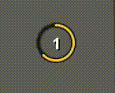

# Cursor Tick Ring

A highly customizable tick ring anchored to the mouse cursor. Heavily inspired by WoW GCD mouse trackers.

## Features

- Gametick synced progress circle around the mouse cursor.
- Fill, remaining, and rotating sweep styles.
- Heavily configurable (size, color, thickness, idle fadeout, smoothness, circle segmented).
- Optional tick labels, tick cycles, click feedback, tick pulse
- Configurable cursor replacements (dot, crosshair, hidden, system).
- Restart cycle and circle overlay hotkeys.
