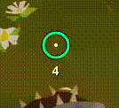
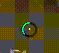
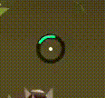
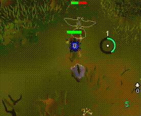

# Cursor Tick Ring

A highly customizable tick ring anchored to the mouse cursor. Heavily inspired by WoW GCD mouse trackers.

  

## Features

- Gametick synced progress circle around the mouse cursor
- Fill, remaining, and rotating sweep styles
- Heavily configurable (size, color, thickness, idle fadeout, smoothness, circle segments)
- Optional sidebar designer with a live preview, sliders, and color pickers
- Optional tick labels, tick cycles, click feedback, tick pulse, accented ticks
- Configurable cursor replacements (dot, crosshair, hidden, system).
- Restart cycle and circle overlay hotkeys.
- Tick cycle presets (hotkeyable)
- Experimental attack timer mode (off by default)
    - Current limitations: special attacks and untested weapons

### Ring styles

  
  

### Attack Mode

  

## Changelog
- Version 1.0.2
    - Added a sidebar designer with a live cursor preview.
    - Added smooth reset fading to the remaining/reverse style.
    - Added food delay to attack mode
    - Added the missing ancient casting to attack mode
- Version 1.0.1 
    - Added attack timer mode for _most_ weapons. Mode overrides the default tick labels.
    - Removed leftover smoothing animation from sweep mode.
